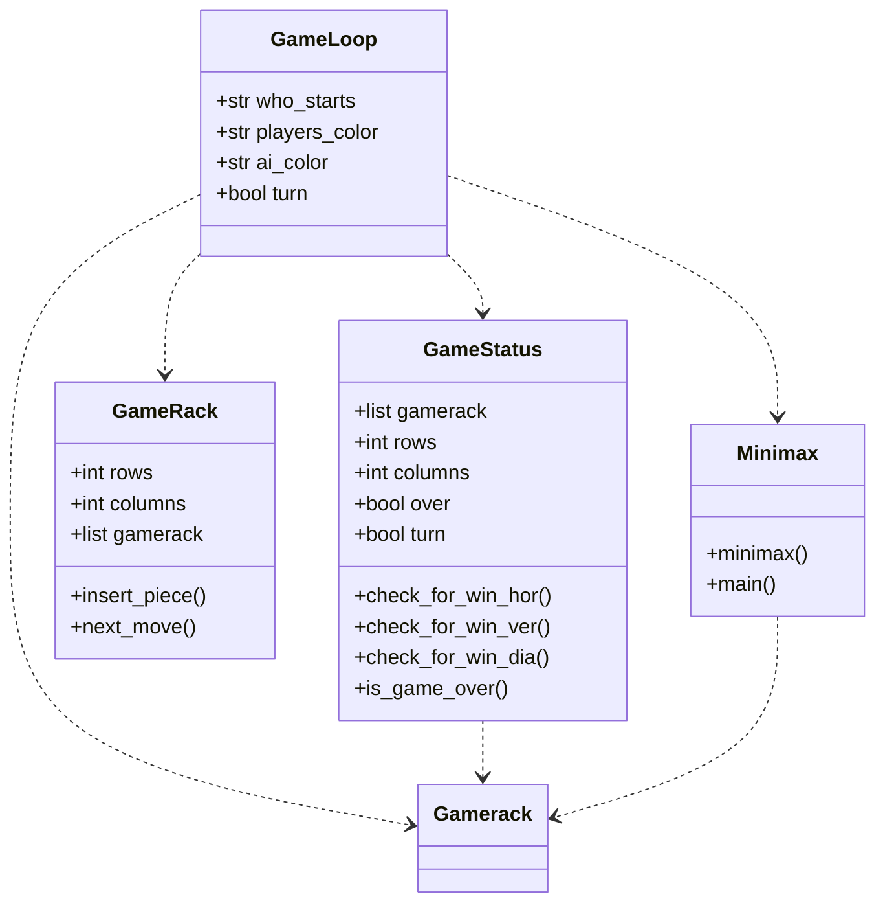

# Implementation document

### Project Structure

### Complexity 

### Improvements
Alpha-beta-pruning is not used yet.

### Sources
- "Connect Four", Wikipedia, wiki article, viewed 22 July 2023, https://en.wikipedia.org/wiki/Connect_Four
- "Minimax" 2023, Wikipedia, wiki article, viewed 22 July 2023, https://en.wikipedia.org/wiki/Minimax
- "Alpha-beta-pruning" 2023, Wikipedia, wiki article, viewed 22 July 2023, https://en.wikipedia.org/wiki/Alpha%E2%80%93beta_pruning
- "Minimax-pelit", viewed 22 July 2023, https://tiralabra.github.io/2023_loppukesa/fi/aiheet/minimax.pdf
