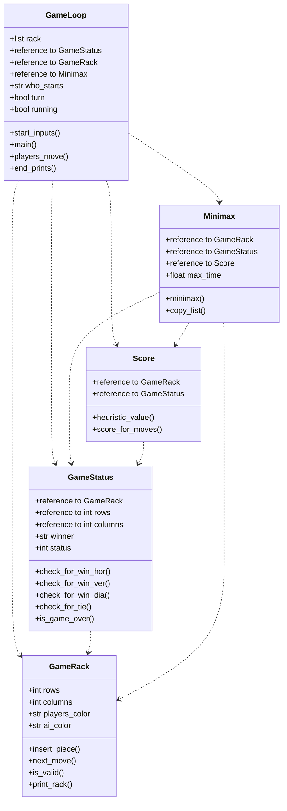

# Implementation document

### Project Structure
#### Class diagram

#### Sequence diagram of program stucture  

```mermaid
sequenceDiagram
    actor Player
    participant GameLoop()
    participant Minimax()
    participant Score()
    participant GameRack()
    Player ->> GameLoop(): user input
    GameLoop() ->> GameRack(): insert piece
    GameLoop() ->> Minimax(): call minimax
    Minimax() ->> Score(): get scores for moves
    Score() -->> Minimax(): return scores
    Minimax() -->> GameLoop(): return best move
    GameLoop() ->> GameRack(): insert piece
    GameLoop() ->> GameLoop(): next round
```
  
### Time complexity 
Alpha-beta-pruning was implemented to improve the time complexity of minimax. The depth I use when calling minimax is 10. I also implemented iterative deepening with a maximum time of 0.5 seconds so the user doesn't have to wait too long. This way, minimax will return the best move with a smaller depth if getting the best move in depth 10 is too slow. I also tested different ways to copy the list to see which one had the best time complexity. The methods I tried were copy.deepcopy(list), json and my own function which iterates the nested list, copies the sublists with sublist.copy() and appends them to a new list. I found the last method to be the fastest. In general, it would be good if the time complexity was better in bigger depths to get better results. It's not as good as it could be, but it still works fine enough in my opinion.

### Possible improvements
I could add a game that can be played with two players instead of playing against an ai. I could also make a pygame implementation of the program. A transposition table could also improve the time complexity. 

### Sources
- "Tiralabra - 2023 loppukesä", viewed 24 August 2023, https://tiralabra.github.io/2023_loppukesa/index
- "Connect Four", Wikipedia, wiki article, viewed 22 July 2023, https://en.wikipedia.org/wiki/Connect_Four
- "Minimax" 2023, Wikipedia, wiki article, viewed 22 July 2023, https://en.wikipedia.org/wiki/Minimax
- "Alpha-beta-pruning" 2023, Wikipedia, wiki article, viewed 22 July 2023, https://en.wikipedia.org/wiki/Alpha%E2%80%93beta_pruning
- "Minimax-pelit", viewed 22 July 2023, https://tiralabra.github.io/2023_loppukesa/fi/aiheet/minimax.pdf
- Kuo, J. 2020, "Artificial Intelligence at Play — Connect Four (Mini-max algorithm explained)", Analytics Vidhya, Medium, viewed 17 August 2023, https://medium.com/analytics-vidhya/artificial-intelligence-at-play-connect-four-minimax-algorithm-explained-3b5fc32e4a4f (for heuristic scoring)
- "unittest.mock — mock object library", viewed 24 August 2023, https://docs.python.org/3/library/unittest.mock.html
- "math — Mathematical functions", viewed 30 August 2023, https://docs.python.org/3/library/math.html
- "Python | Ways to print list without quotes", GeeksforGeeks, viewed 29 August 2023, https://www.geeksforgeeks.org/python-ways-to-print-list-without-quotes/
- "time — Time access and conversions", viewed 3 September 2023, https://docs.python.org/3/library/time.html
