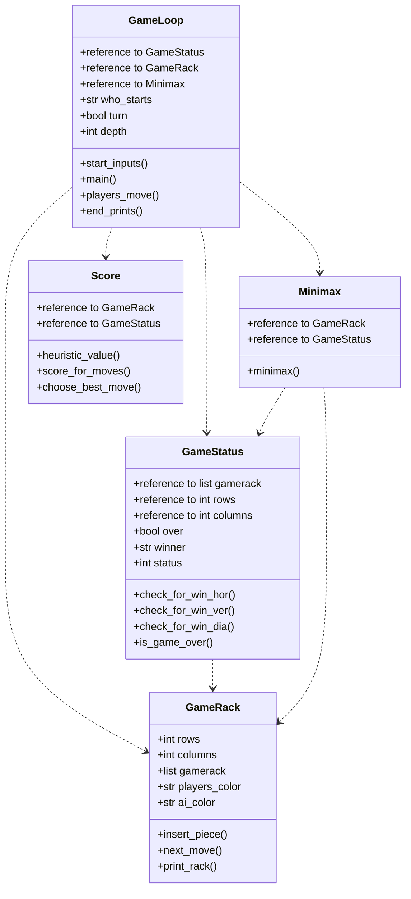

# Implementation document

### Project Structure

### Complexity 
| **file** | **time**
| --------- | ----------- 
| gameloop.py | 
| minimax.py |
| gamestatus.py | 
| gamerack.py |
| score.py |

### Improvements
Alpha-beta-pruning is not used yet.

### Sources
- "Tiralabra - 2023 loppukesä", viewed 24 August 2023, https://tiralabra.github.io/2023_loppukesa/index
- "Connect Four", Wikipedia, wiki article, viewed 22 July 2023, https://en.wikipedia.org/wiki/Connect_Four
- "Minimax" 2023, Wikipedia, wiki article, viewed 22 July 2023, https://en.wikipedia.org/wiki/Minimax
- "Alpha-beta-pruning" 2023, Wikipedia, wiki article, viewed 22 July 2023, https://en.wikipedia.org/wiki/Alpha%E2%80%93beta_pruning
- "Minimax-pelit", viewed 22 July 2023, https://tiralabra.github.io/2023_loppukesa/fi/aiheet/minimax.pdf
- Kuo, J. 2020, "Artificial Intelligence at Play — Connect Four (Mini-max algorithm explained)", Analytics Vidhya, Medium, viewed 17 August 2023, https://medium.com/analytics-vidhya/artificial-intelligence-at-play-connect-four-minimax-algorithm-explained-3b5fc32e4a4f (for heuristic scoring)
- "unittest.mock — mock object library", viewed 24 August 2023, https://docs.python.org/3/library/unittest.mock.html
