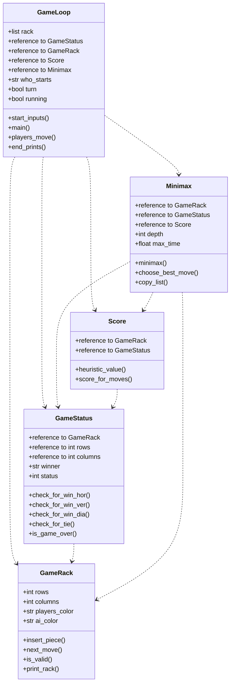

# Implementation document

### Project Structure
#### Class diagram

#### Sequence diagram of program stucture  

```mermaid
sequenceDiagram
    actor Player
    participant GameLoop()
    participant Minimax()
    participant Score()
    participant GameRack()
    Player ->> GameLoop(): user input
    GameLoop() ->> GameRack(): insert piece
    GameLoop() ->> Minimax(): call minimax
    Minimax() ->> Score(): give scores
    Score() -->> Minimax(): return score
    Minimax() -->> GameLoop(): return best move
    GameLoop() ->> GameRack(): insert piece
```
  
### Time complexity 
Right now time complexity of the program is not good enough.

### Possible improvements
I could add a game that can be played with two players instead of playing against an ai. I could also make a pygame implementation of the program.

### Sources
- "Tiralabra - 2023 loppukesä", viewed 24 August 2023, https://tiralabra.github.io/2023_loppukesa/index
- "Connect Four", Wikipedia, wiki article, viewed 22 July 2023, https://en.wikipedia.org/wiki/Connect_Four
- "Minimax" 2023, Wikipedia, wiki article, viewed 22 July 2023, https://en.wikipedia.org/wiki/Minimax
- "Alpha-beta-pruning" 2023, Wikipedia, wiki article, viewed 22 July 2023, https://en.wikipedia.org/wiki/Alpha%E2%80%93beta_pruning
- "Minimax-pelit", viewed 22 July 2023, https://tiralabra.github.io/2023_loppukesa/fi/aiheet/minimax.pdf
- Kuo, J. 2020, "Artificial Intelligence at Play — Connect Four (Mini-max algorithm explained)", Analytics Vidhya, Medium, viewed 17 August 2023, https://medium.com/analytics-vidhya/artificial-intelligence-at-play-connect-four-minimax-algorithm-explained-3b5fc32e4a4f (for heuristic scoring)
- "unittest.mock — mock object library", viewed 24 August 2023, https://docs.python.org/3/library/unittest.mock.html
- "math — Mathematical functions", viewed 30 August 2023, https://docs.python.org/3/library/math.html
- "Python | Ways to print list without quotes", GeeksforGeeks, viewed 29 August 2023, https://www.geeksforgeeks.org/python-ways-to-print-list-without-quotes/
